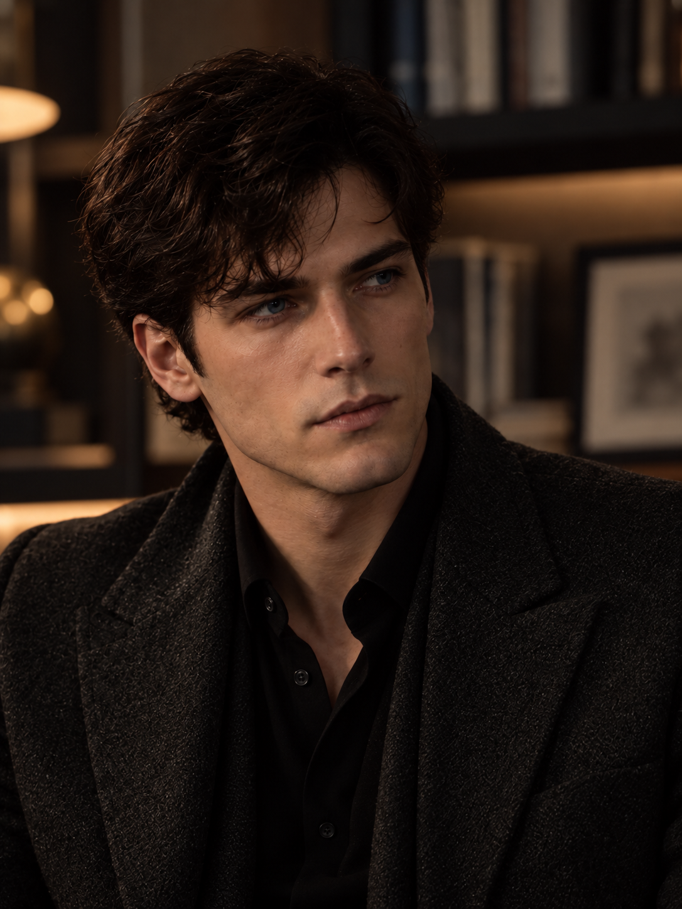

# A01｜从人物气质重新生成半侧脸

## 作者要求与本次范围

作者对N03仍不满意，进一步明确：

> 你不要只分析对比 你要从卡瑞洛这个人的气质和这个生成的人的气质的相符程度来看

作者认可随后从人物主导性、审视、克制下的潜在越界意志展开的分析，并授权：

> 对 那你重新生成一下

本轮优先验证“这个人是否让人相信他是卡瑞洛”。身体松弛、注意力主动且有选择、口周不过度绷紧；保留智性内敛、少量危险和习惯作决定的状态。构图和表演情境是本次试验选择，不新增人物情节或永久设定。

## 图片与来源



- 保存图片：[MC_CHARACTER_A01_半侧脸_松弛审视候选_v1.png](MC_CHARACTER_A01_半侧脸_松弛审视候选_v1.png)
- 原始身份参考：[MC_FACE_REF_001](../01_原始参考/MC_FACE_REF_001_冷战后期克制请求_原图.jpg)
- 当前钢蓝与外貌呈现参考：[MC_EYE_B03_v2](../08_蓝眼色对照_2026-10-07/MC_EYE_B03_钢蓝_近正面_v2.png)
- 未采用N01—N03及书桌未定稿候选作本轮输入。
- 生成方式：内置 image_gen；接口未提供底层模型版本，不作型号声明。
- 原始生成文件：`C:\Users\kdsha\.codex\generated_images\01a1125e-3dd4-7013-87aa-585e0a6f1ace\exec-c78da823-4e83-4da8-9f4a-b2298b67e2d9.png`
- 图片尺寸：1086 × 1448
- SHA256：`768E580D07913A01890397ED8E768FFA82A92ECC42BDE12EDE168305A00A3477`
- 原始文件与项目副本哈希一致；保留原始生成文件，未覆盖旧图。

## 助手初评（与作者反馈分开）

这张延续了认可正面的主要外貌，嘴部较放松，目光转向画外，表现出持续注意；上一轮紧绷、戒备的观感有所减弱。

人物气质仍有保留：整体偏文雅、年轻，主导性及克制下可能介入他人处境的危险感仍较含蓄，不能仅凭表情平静认定已达成。实际转角较浅，仍有轻微头部倾斜；提示词中的35—40度为目标而非测量结果。本图不能充当完整侧视结构验证。

## 当前用途和边界

用于继续评估掌权状态下的主动审视与外貌连续性。作为有保留的正向候选保存，暂不纳入正式认可图精选，不替代原始脸部身份锚点，不固定侧脸结构、身体体量或永久发型。

## 作者反馈｜2026年10月8日

> 这个好像还行 略有些危险

这是对本张的试探性正向反馈：作者感受到少量危险，未确认定稿或要求进一步加重威胁。保留现图作为后续人物气质对照；不把“略有些危险”自动升级成全部权力感、智性感或多视角一致性已通过。

助手后续判断：目光持续停留于画外对象，口周并未同步作出明显回应，开始形成结论有所保留的观感。当前值得保留这种含蓄程度；进一步加重危险并非本次授权。

## 完整提示词

```text
Use case: photorealistic-natural.
Asset type: one cinematic character-development portrait of the adult fictional character Carrillo, a fresh three-quarter view for author review.

Input images: Image 1 is the original facial-identity reference; preserve this man's individual facial structure and natural asymmetry. Image 2 is the approved current rendering of the SAME character, especially the medium-dark STEEL-BLUE irises and warm ivory complexion. Both images provide identity, not a pose or expression to duplicate. Generate a new photograph of him.

Primary request: show Carrillo as an intellectually inward, habitual decision-maker with restrained danger and effortless authority. His silence has agency. He has noticed something in the account of an unseen person across the room and allows the silence to continue while he considers his decision. Portray this as a believable quiet moment, without theatrical villain acting.

Performance direction: eyes steadily attend to one specific off-camera person; the attention is selective, intent, and sustained, with no appeal for reassurance. Forehead and inner brows mostly at rest; natural eyelids, no forced squint. The mouth rests closed very lightly, lips retaining the reference's shape and fullness, corners neutral, jaw unclenched. The face reveals very little of his conclusion. His torso is comfortably settled, shoulders naturally open and dropped, neck upright over the torso, chin level; no forward lean, defensive contraction or accommodating head tilt. Preserve a sense of suppressed will beneath outward ease rather than friendly receptivity. He is an adult accustomed to his decisions taking effect.

Composition: a single color photograph, vertical 3:4, chest-up, eye-level camera, natural portrait-lens perspective. Turn his head and torso about 35–40 degrees toward screen right so the nose–lip–chin relationship is visible while both eyes can still be read. His gaze remains at a natural off-camera conversational distance, not into the lens. Anatomically coherent neck, natural head-to-shoulder scale.

Appearance: preserve the original nose, cheekbones, mouth, supported chin and face proportions; no deliberate face-lengthening or jaw enlargement. Dark naturally wavy hair, restrained volume and a tidy shorter nape, natural grooming without a glamorous flowing hairstyle. Charcoal fine-textured jacket, black open-collar shirt as in the approved frontal image. Real skin texture, mature adult facial detail without artificial aging.
Setting and light: subdued study, softly out-of-focus shelves, restrained warm-neutral colors. Gentle directional daylight models the face with clear but not harsh cheek and orbital planes. Keep mouth contour and eyes visible; steel-blue irises remain subdued and dark enough, with a small natural catchlight.

Avoid: tense pout, projecting pursed lips, sneer, smirk, flirtation, glaring, angry frown, raised chin, exaggerated dominance pose, boyish wide-eyed innocence, blank mannequin stare, heroic square-jaw redesign, hollow-cheek caricature, overlarge head, beauty retouching, dramatic noir concealment. No other people, weapons, smoking, text, labels, or watermark.
```

