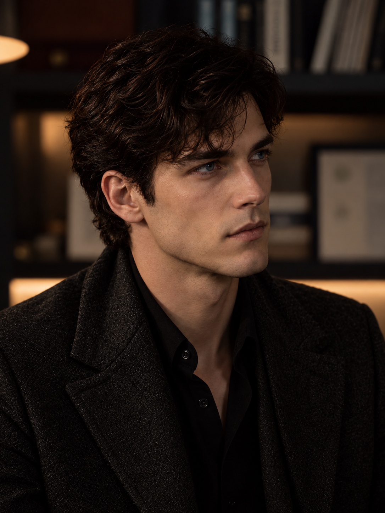
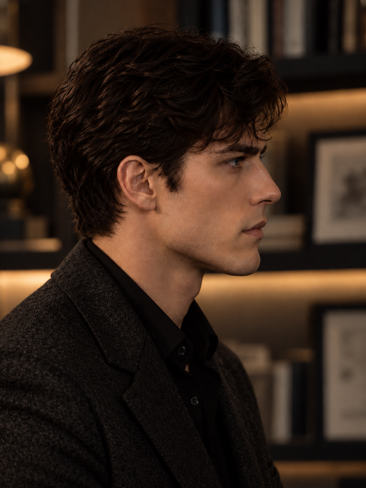
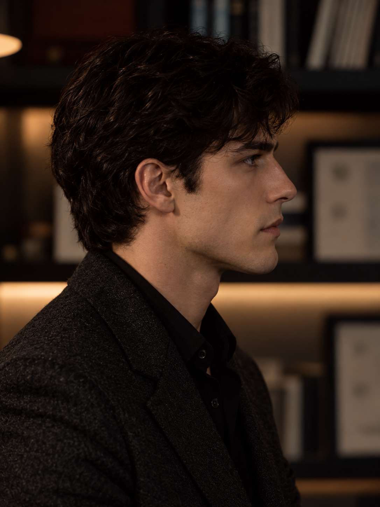

# 三分之四与正侧脸｜人物气质多视角校准

## 作者要求与连续性

作者对上一张A01反馈“这个好像还行 略有些危险”，随后提出：

> 那我们是不是还得生成三分之四侧脸和正侧脸

本轮据此补充两个角度，继续以人物相符程度为优先：智性内敛、主动审视、安静中有主导性，保留A01的少量危险。A01的正向反馈不自动延伸至本轮新图。作者随后指出P02后脑勺显大、整个头显宽，并授权在符合人物的前提下修改，已生成[P03局部发量修正](02_P03后枕发量与人物气质_生成记录与完整提示词.md)。作者复看仍觉得P03“不太像卡瑞洛”，P03不作为人物气质通过或侧脸锚点；T03尚待评价。

## 当前主要候选

最新局部试验为[P05轻成熟感与发量校准](04_P05轻成熟感与发量校准_生成记录与完整提示词.md)。作者对P04视觉上略年轻仍存疑，在讨论保留脸与神态、轻调发型和光影后授权生成；P05待复看，P04的相对正向反馈保留。

最新正侧方向为[P04审视神态重建](03_P04正侧脸审视神态重建_生成记录与完整提示词.md)。作者认为P03人物仍不相符后，已授权从认可正面与A01神态重新生成，并仅取P03的发量和侧向构图作为辅助。作者复看表示“这个脸好点”，后脑是否过宽仍有疑问；P04为有保留的相对偏好，未定稿。

### T03｜三分之四侧脸



目前本轮转角最明确的三分之四候选。远侧眼与面颊明显收窄，鼻部投影更清晰；仍能保留双眼参与的注意力。提示词中的50—55度为生成目标，不是对图片的测量结论。

### P04｜审视神态重建（脸部相对好转，后脑体积存疑）



本次把眼周的集中与口周的从容分开处理；作者给予脸部相对正向反馈，但整体人物及头部体积仍未确定。详见[P04独立记录与完整提示词](03_P04正侧脸审视神态重建_生成记录与完整提示词.md)。

### P02｜原正侧脸对照



以侧面单眼、完整鼻唇颏轮廓为主要检验点，较P01更接近正侧。无法从生成图确认精确90度或多视角三维完全一致，不作为永久侧脸锚点。

作者后续反馈为“后脑勺有点大了 整个头有点宽”，P02转为编辑前对照。后枕、耳后及后颈发量修正结果见[P03](02_P03后枕发量与人物气质_生成记录与完整提示词.md)，不把P02的局部修改授权视为整体定稿。

## 人物气质初评（助手判断）

T03延续了安静、专注和保留判断的方向，眉眼有注意力，嘴部较少紧绷。P02把面部轮廓展开，但双眼互动信息减少，人物显得更沉静，其审视和危险感比浅侧转更难读取。两张都仍有偏年轻、文雅的观感，是否符合卡瑞洛须由作者复看，不能因角度覆盖较完整便认定气质通过。

本轮没有以加宽下颌、拉长脸、加怒容补足权力感。后续仍按“这是否像卡瑞洛这个人”评估，再看外貌连续性及鼻唇颏结构。

## 文件与过程对照

| 编号 | 图片与用途 | 状态 |
|---|---|---|
| T01 | [转角偏浅过程对照](MC_ANGLE_T01_三分之四侧脸_克制审视候选_v1.png) | ANGLE_PROCESS_COMPARISON |
| P01 | [接近侧面过程对照](MC_ANGLE_P01_正侧脸_克制审视候选_v1.png) | ANGLE_PROCESS_COMPARISON |
| T02 | [转角校正过程对照](MC_ANGLE_T02_三分之四侧脸_转角校正候选_v2.png) | ANGLE_PROCESS_COMPARISON |
| P02 | [正侧脸编辑前对照](MC_ANGLE_P02_正侧脸_转角校正候选_v2.png) | AUTHOR_REAR_HEAD_VOLUME_CONCERN / EDIT_REQUESTED |
| T03 | [当前三分之四侧脸候选](MC_ANGLE_T03_三分之四侧脸_明确转角候选_v3.png) | CANDIDATE / AUTHOR_REVIEW_PENDING |
| P03 | [后枕发量收敛候选](MC_ANGLE_P03_正侧脸_后枕发量收敛候选_v3.png) | AUTHOR_TEMPERAMENT_MISMATCH / NOT_PROFILE_ANCHOR |
| P04 | [审视神态重建候选](MC_ANGLE_P04_正侧脸_审视神态重建候选_v4.png) | RELATIVE_AUTHOR_FACE_PREFERENCE / REAR_HEAD_VOLUME_QUESTION |
| P05 | [轻成熟感与发量候选](MC_ANGLE_P05_正侧脸_轻成熟感与发量校准候选_v5.png) | CANDIDATE / AUTHOR_REVIEW_PENDING |

T01、T02转角与A01仍较接近，保留为过程对照。P01仍露出部分远侧眉眼，不把它当作严格正侧脸。后两张T03、P02从原始身份与认可钢蓝正面重新生成，未把本轮未认可候选作为下一张的输入。

## 来源、保存与使用边界

- 身份参考：[MC_FACE_REF_001](../01_原始参考/MC_FACE_REF_001_冷战后期克制请求_原图.jpg)
- 认可钢蓝正面：[MC_EYE_B03_v2](../08_蓝眼色对照_2026-10-07/MC_EYE_B03_钢蓝_近正面_v2.png)
- 有保留的正向状态参考：[A01](../16_人物气质重建_2026-10-08/00_生成记录与完整提示词.md)
- 生成方式：内置 image_gen；未调用CLI或外部API，接口未提供底层模型版本。
- 首组成功生成五张。首次正侧请求出现连接失败，没有返回图片；同工具重试成功。后续另生成P03局部发量修正、P04审视神态重建、P05轻成熟感试验。原始输出均保留，项目副本逐一核对SHA256。
- 尺寸均为1086 × 1448。首组五张的完整来源路径、SHA256及输入列表见[来源校验清单](01_图片来源与校验.json)；后续来源及校验分别见[P03记录](02_P03后枕发量与人物气质_生成记录与完整提示词.md)、[P04记录](03_P04正侧脸审视神态重建_生成记录与完整提示词.md)与[P05记录](04_P05轻成熟感与发量校准_生成记录与完整提示词.md)。
- T03、P05待作者复看；P02已记录后半头体积的修改意见，P03已记录人物气质仍不相符的反馈；P04记录脸部相对偏好、后脑体积及视觉成熟度疑问。候选不加入正式认可图精选，不替换现有身份锚点，不锁定永久侧脸、发型或身体比例。

## 完整提示词

### T01｜转角偏浅过程对照

输入：原始身份参考、认可钢蓝正面、A01状态参考三张。

```text
Use case: photorealistic-natural.
Asset type: ONE color cinematic portrait for a fictional character's angle and performance calibration, not a collage.

Input references: Image 1 is the original identity anchor for Carrillo, an adult fictional man. Image 2 is the approved frontal rendering of the same character and the specific medium-dark STEEL-BLUE eyes. Image 3 is a tentative positive reference ONLY for his restrained, slightly dangerous scrutiny, relaxed mouth, clothing, and subdued study lighting. Preserve the facial identity from images 1 and 2. Do not simply copy the shallow angle or tilted head of image 3.

Character: an intellectually inward adult accustomed to deciding how events proceed. His attention rests deliberately on one unseen person, with very little visible response. He allows the person to keep speaking while he withholds his conclusion. His body is comfortable and settled, his brow mostly at rest, mouth closed very lightly with neutral corners, jaw relaxed. Sustained discerning attention and suppressed will under outward ease. Restrained danger, not theatrical hostility. Shoulders naturally open and dropped, head upright over the spine, chin neutral, no accommodating tilt or lean.

Identity: maintain the individual nose shape and projection, brow-to-eye relationship, cheekbones, natural lip shape and fullness, supported chin, jaw proportions, subtle asymmetry, and warm ivory skin of the identity references. No face-lengthening, enlarged jaw, infantilization, or beauty-standard redesign. Lips at natural rest, not pushed or pursed forward. Dark wavy hair with restrained volume and tidy shorter nape; charcoal textured jacket and black open-collar shirt. Medium-dark steel-blue irises with subdued natural reflections.

Photography: chest-up vertical 3:4 composition; natural portrait-lens perspective; camera at eye level; correct head-to-shoulder proportions and anatomical neck alignment. Subdued study with blurred shelves, warm-neutral colors, soft directional daylight. Show natural skin texture and adult detail. Keep the cheek planes and entire nose-lip-chin contour readable, including the relaxed mouth, with gentle fill rather than hiding geometry in deep shadow. No added props or people.

Avoid: angry frown, forced squint, sneer, smirk, tense pout, chin jutting, compressed posture, pleading upward gaze, blank mannequin expression, innocence, exaggerated intimidation, hollow-cheek caricature, large head, icy bright eyes, flowing romantic hair, heavy retouching, any text, watermarks, smoking, or weapons.

ANGLE REQUIREMENT — THREE-QUARTER:
Generate a clearly rotated three-quarter face toward screen RIGHT, approximately 45 degrees away from a frontal view. This must be visibly more turned than reference 3. Both eyes remain visible, with the far eye and far cheek naturally foreshortened. The nose overlaps part of the far cheek. The head and neck remain upright without roll. Torso turns with the head enough to keep the neck comfortable. His eyes look in the same general direction as the face toward the unseen person at eye level, not back toward the camera. Preserve the character's inward scrutiny at this angle. One single photograph.
```

### P01｜接近侧面过程对照

输入：原始身份参考、认可钢蓝正面、A01状态参考三张。

```text
Use case: photorealistic-natural.
Asset type: ONE color cinematic portrait for a fictional character's angle and performance calibration, not a collage.

Input references: Image 1 is the original identity anchor for Carrillo, an adult fictional man. Image 2 is the approved frontal rendering of the same character and the specific medium-dark STEEL-BLUE eyes. Image 3 is a tentative positive reference ONLY for his restrained, slightly dangerous scrutiny, relaxed mouth, clothing, and subdued study lighting. Preserve the facial identity from images 1 and 2. Do not simply copy the shallow angle or tilted head of image 3.

Character: an intellectually inward adult accustomed to deciding how events proceed. His attention rests deliberately on one unseen person, with very little visible response. He allows the person to keep speaking while he withholds his conclusion. His body is comfortable and settled, his brow mostly at rest, mouth closed very lightly with neutral corners, jaw relaxed. Sustained discerning attention and suppressed will under outward ease. Restrained danger, not theatrical hostility. Shoulders naturally open and dropped, head upright over the spine, chin neutral, no accommodating tilt or lean.

Identity: maintain the individual nose shape and projection, brow-to-eye relationship, cheekbones, natural lip shape and fullness, supported chin, jaw proportions, subtle asymmetry, and warm ivory skin of the identity references. No face-lengthening, enlarged jaw, infantilization, or beauty-standard redesign. Lips at natural rest, not pushed or pursed forward. Dark wavy hair with restrained volume and tidy shorter nape; charcoal textured jacket and black open-collar shirt. Medium-dark steel-blue irises with subdued natural reflections.

Photography: chest-up vertical 3:4 composition; natural portrait-lens perspective; camera at eye level; correct head-to-shoulder proportions and anatomical neck alignment. Subdued study with blurred shelves, warm-neutral colors, soft directional daylight. Show natural skin texture and adult detail. Keep the cheek planes and entire nose-lip-chin contour readable, including the relaxed mouth, with gentle fill rather than hiding geometry in deep shadow. No added props or people.

Avoid: angry frown, forced squint, sneer, smirk, tense pout, chin jutting, compressed posture, pleading upward gaze, blank mannequin expression, innocence, exaggerated intimidation, hollow-cheek caricature, large head, icy bright eyes, flowing romantic hair, heavy retouching, any text, watermarks, smoking, or weapons.

ANGLE REQUIREMENT — STRICT PROFILE:
Generate a TRUE 90-degree right-facing profile: camera exactly perpendicular to the facial sagittal plane, head facing screen RIGHT. Only the near eye is visible; far eye and far eyebrow are completely hidden. The outline of forehead, nose bridge and tip, both lips, chin and jaw must be unobstructed and naturally coherent. This is not a 70-degree near-profile or another three-quarter view. Neck upright, head without downward pitch or sideways roll; torso oriented consistently so no neck twist. Gaze is level along the direction the nose points, focused on the unseen person, never looking back at the camera. Maintain quiet, deliberate attention with relaxed brow and mouth; don't substitute a blank neutral anatomy specimen for the character. One single photograph.
```

### T02｜转角校正过程对照

输入：原始身份参考、认可钢蓝正面、A01状态参考三张。

```text
Generate ONE photorealistic color portrait of the same adult fictional man, Carrillo, at a DISTINCT THREE-QUARTER ANGLE, with his face turned 45–50 degrees toward screen right. The geometric change of viewpoint is essential: only a narrow foreshortened strip of the far cheek is visible, the far eye is visibly narrower than the near eye, and the projected nose approaches the far cheek outline. Keep both eyes visible. Do not repeat the shallow face angle of the references. Keep head level without sideways tilt.

Reference 1: original facial identity. Reference 2: approved frontal identity and medium-dark steel-blue irises. Reference 3: quiet, slightly dangerous attention and relaxed mouth ONLY; ignore its viewpoint. Keep the same recognizable nose, lips, cheekbones and supported chin. Do not elongate the face, narrow it into a different man or enlarge the jaw.

Performance: Carrillo is an inward, selective observer accustomed to making consequential decisions. His gaze rests on a specific unseen person at eye level in the direction he faces. He listens without yielding initiative or revealing his conclusion. Calm forehead, natural eyelids, mouth lightly closed and at rest, neutral mouth corners, relaxed jaw. Preserve restrained danger beneath outward ease. No frown, smirk, pout, reassurance-seeking, blankness or flamboyant villain performance.

Body and photography: comfortable upright torso turned consistently with his head; naturally open, dropped shoulders. Chest-up portrait, eye-level camera and normal portrait-lens proportions. Dark restrained wavy hair, tidy nape, charcoal textured jacket, black open-collar shirt. Subdued warm-neutral study and softly directional daylight, natural adult skin texture, clear readable face planes and mouth contour. No dramatic shadows hiding facial structure. No other people, text, watermark, weapons or smoking. Single vertical 3:4 image.
```

### P02｜当前正侧脸候选

输入：原始身份参考、认可钢蓝正面两张。

```text
Create ONE new photograph of this same fictional adult man, Carrillo, in a STRICT RIGHT-FACING LATERAL PROFILE for a character turnaround. Move the CAMERA fully around to his left side, exactly perpendicular to the direction his nose points. His face points to the RIGHT edge of the image. Show the near ear, near cheek and a SINGLE near eye seen SIDE-ON; the near iris is foreshortened, not a full frontal almond-shaped eye. The ENTIRE far eye, far eyebrow, far lashes and far cheek are hidden behind the nose/forehead. Nose, lips and chin form the right outer silhouette against the background. Head level, no downward pitch or roll. A true side elevation, not a three-quarter or near-profile photograph. This viewpoint requirement is essential.

Reference 1 supplies the facial identity. Reference 2 supplies the same face with approved dark steel-blue eyes. Use these frontal references to construct a plausible side view; do not copy their camera angle, tilted head or gaze direction. Maintain his individual straight nose, natural lips, cheekbone structure and supported chin; no arbitrary face-lengthening or oversized square jaw.

Carrillo's presence: intellectually reserved, quietly self-possessed, accustomed to making consequential decisions. His attention is deliberate and intent, calmly directed at one unseen person straight ahead at eye level. He keeps his conclusion to himself. Forehead at rest, mouth lightly closed without pursing or forward pout, jaw unclenched. Subtle danger under composure. No angry frown, smirk, pleading, timidity, vacant stare or exaggerated villain acting. Preserve adult maturity and natural skin texture.

Chest-up vertical 3:4 color photograph. Upright comfortable torso faces consistently with the head; shoulders down, neck naturally aligned. Restrained dark wavy hair with a tidy nape, charcoal textured jacket and black open-collar shirt. Soft directional daylight in a subdued warm-neutral study, blurred shelves. Readable complete nose-lip-chin outline, gentle shadows, no silhouette blackout. Realistic portrait-lens perspective and head proportions. No other people, props, smoking, weapons, text or watermark.
```

### T03｜当前三分之四侧脸候选

输入：原始身份参考、认可钢蓝正面两张。

```text
Create one new photorealistic portrait of the SAME fictional adult man in these two identity reference images. Camera viewpoint is the primary task: a CLEAR THREE-QUARTER VIEW with the face turned about 50–55 degrees toward the RIGHT side of the picture. The camera has physically moved around him. Both eyes are visible, but the far eye is markedly foreshortened and its inner portion is partly occluded by the bridge of the nose; only a narrow far-cheek strip remains visible. The nose projects conspicuously toward the far facial silhouette. Show the near ear fully. Do not repeat a near-frontal or shallow 20–30 degree turn. Do not create a full profile. Head upright without lateral tilt.

Image 1 defines Carrillo's original individual facial identity. Image 2 defines the same face and approved dark steel-blue eyes. Keep the original nose, mouth shape, cheekbones, chin and adult facial proportions. Preserve his warm ivory complexion, dark wavy hair, and natural asymmetry. No face-lengthening or new actor.

Character performance: intellectually inward and quietly self-possessed. He deliberately watches an unseen person in the direction his face points at eye level, patiently holding his judgment. He is accustomed to making consequential decisions and does not seek reassurance. A trace of danger in concentrated attention, an almost still face and a relaxed, lightly closed mouth. Natural brow, no scowl, no squint, no smirk or pout. Calm presence with agency; no friendly invitation, blankness or exaggerated threat.

Chest-up 3:4 color photograph, eye-level portrait lens. Neck upright and anatomically aligned with a comfortably settled torso, shoulders naturally open. Charcoal textured jacket over a black open-collar shirt; tidy nape and restrained dark waves. Subdued warm-neutral study with blurred bookshelves and soft directional daylight. Readable cheek and mouth contours, real skin texture. No additional people, smoking, props, text or watermark.
```

