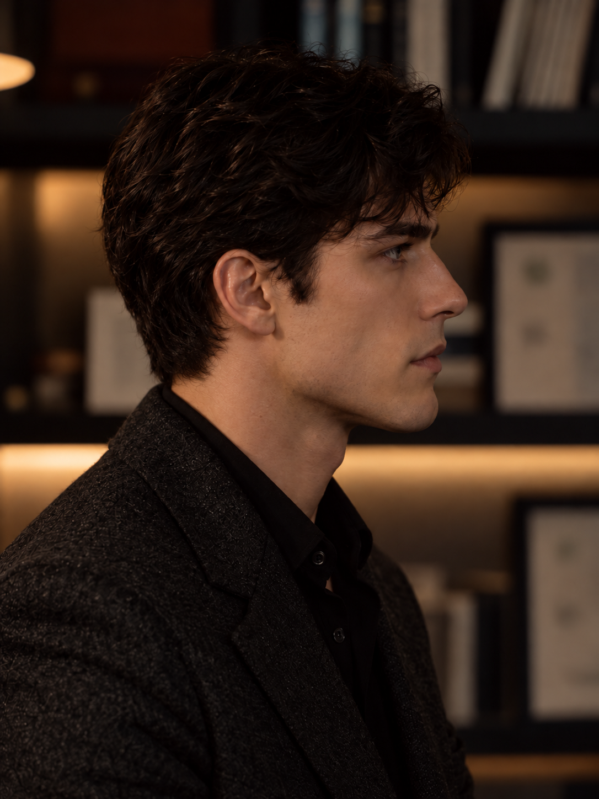

# P03｜正侧脸后枕发量收敛

## 作者反馈与编辑授权

作者对P02正侧脸提出：

> 侧面的话我会觉得他的后脑勺有点大了 整个头有点宽？你觉得呢

助手判断可见问题主要来自后枕、耳后和后颈连续的厚发量，使侧面前后跨度显大；不能直接据此认定头骨过大。建议先减少这些区域的发量，保留前额与顶部自然微卷，观察整体变化。

作者随后授权：

> 对 你改改 注意要符合人物

本次针对P02做局部编辑。人物要求继续是智性、内敛、有主动审视和含蓄危险；发型偏实用、有秩序，避免通过夸张造型突出美貌。编辑授权不等于作者接受P02全部气质或侧脸结构。

## 结果



- 当前候选：[P03](MC_ANGLE_P03_正侧脸_后枕发量收敛候选_v3.png)
- 编辑前：[P02](MC_ANGLE_P02_正侧脸_转角校正候选_v2.png)
- 本轮总记录：[两视角校准](00_两视角生成记录与完整提示词.md)

## 助手初评

后枕最外侧轮廓有所内收，耳后至后颈的厚发尾明显缩短，头与颈的连接更利落。顶部自然微卷与前额形状仍保留，面部轮廓、口周和目光整体延续P02，没有借本次改发量重新塑造五官或增加怒容。

从人物呈现看，蓬松、松软的后半头体积减弱，整理方式更克制。此次可见改善集中在发型轮廓；作者后续仍认为人物不像卡瑞洛，因此不纳入正式认可图精选，也不升级为身份或侧脸锚点。

## 作者复看与气质校准

> 那你点评一下这个脸的气质 感觉还是不太像卡瑞洛

作者未认可本张人物气质，也未单独确认发量修改已满意。助手的“更接近卡瑞洛”表述应收回到局部轮廓更利落这一可见层面。

助手复看判断：画面更偏沉静、自持、略疏离的年轻男性，未明显讨好或憨厚，但主动判断、惯常决定局势的主导性和克制下的潜在侵入感仍不足。此前过多强调放松眉头、嘴部和姿态，可能把外在克制连同人物内在的压力一起削弱；发型整理不能解决这一问题。后续不能自动通过加凶、变老或继续削窄脸型补足，也不能把本张视为已确立的人物基础。

## 保存与来源

- 工具：内置 image_gen，单张局部编辑。
- 唯一输入：`D:/新建文件夹/ainu_dynamics/5th_round_INTJ芷瞳AU/_图像素材与视觉设定_2026-07-16/01_卡瑞洛/17_人物气质多视角校准_2026-10-08/MC_ANGLE_P02_正侧脸_转角校正候选_v2.png`
- 原始生成文件：`C:\Users\kdsha\.codex\generated_images\01a1125e-3dd4-7013-87aa-585e0a6f1ace\exec-1b9ef523-7793-4e6d-949a-d170d21442e6.png`
- 项目副本：`D:/新建文件夹/ainu_dynamics/5th_round_INTJ芷瞳AU/_图像素材与视觉设定_2026-07-16/01_卡瑞洛/17_人物气质多视角校准_2026-10-08/MC_ANGLE_P03_正侧脸_后枕发量收敛候选_v3.png`
- 尺寸：1086 × 1448
- SHA256：`ABF7E70619B88BE529BEC37519C7A304432FAD1F2B68728E55E9AA5F80DFB583`
- 原始输出与项目副本哈希一致。保留原图及旧候选，未覆盖文件。
- 工具未提供底层模型版本，不作具体型号声明。

## 完整提示词

```text
Use case: precise-object-edit.
Input image: the supplied right-facing profile portrait is the EDIT TARGET. Make one carefully localized hair-volume correction to this exact image of the adult fictional character Carrillo.

CHANGE ONLY the excess bulk of the hair behind the ear, over the rear crown/occiput, and at the nape. The current large, inflated rounded hair envelope makes the back half of the head look too deep and heavy. Bring that rear outline modestly but visibly inward, reduce the puffy rear dome and thick ear-to-nape accumulation, and taper the lower hair naturally into a cleaner nape. Keep believable adult cranial volume underneath; this is a reduction of excess hair, not a compressed or flattened skull. Preserve enough hair to look naturally full.

Keep his dark natural waves and their texture, the recognizable front fringe and forehead framing, and most of the existing top height. Grooming should feel practical, restrained and habitual: an intellectually inward man accustomed to authority who does not spend his attention displaying his beauty. The result should feel more controlled and precise while retaining his individual appearance and quiet, slightly dangerous attention. Natural scissor-cut blending, no skin fade, military buzz cut, undercut, gelled slick-back, fashionable makeover or ornate styling.

STRICT INVARIANTS: keep the same adult man, same facial bone structure, nose bridge and tip, lip shape and fullness, mouth at rest, chin and jawline, eye shape and subdued steel-blue iris, skin texture and complexion. Keep the exact ear position and size, head position, right-facing profile angle, gaze, calm brow and facial expression. Preserve his natural head-to-body scale, upright neck, torso, shoulders, charcoal jacket, black shirt, warm study, framing, lens perspective, lighting and color. Do not lengthen or slim the face, shrink the entire head, move the ear, thicken the neck, widen the shoulders, add a frown or make him younger or more innocent.

Return one photorealistic edited portrait, with a clearly cleaner but still natural posterior hair silhouette and the rest of the image unchanged as closely as possible. No text or watermark.
```

