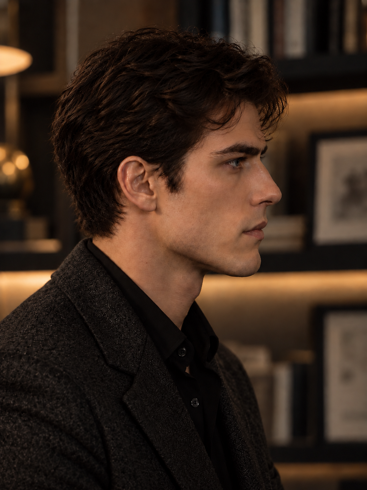

# P05｜轻成熟感与发量校准

## 作者反馈与授权

作者对P04先给出“这个脸好点”的相对正向反馈，并对后脑是否过宽存疑；之后进一步表示：

> 确实有点略年轻了 我不确定 你看看

助手建议保留当前脸和审视状态，通过小幅收上后方发量、略打开额前、让眼眶和颧部光影更清楚，试验轻微成熟感。未确定新的数字年龄，也未将“年轻”定为必须通过老化解决的缺陷。

作者随后授权：

> 那你试试

## 候选图片



[原尺寸图片](MC_ANGLE_P05_正侧脸_轻成熟感与发量校准候选_v5.png) · [编辑前P04](MC_ANGLE_P04_正侧脸_审视神态重建候选_v4.png)

## 本轮修改范围

本轮只编辑P04。保留侧向构图、脸部身份、眼神、自然闭合的嘴部、身姿与服装；适度整理额前及上后方头发，并微调光影层次。不通过皱纹、浓胡茬、眼袋、灰发、削瘦面颊或加宽下颌制造年龄感。

## 助手初评

可见变化最集中于额前：露出更多额角与眉骨上方区域，同时保留自然弯曲的发束。眼眶、颧部的层次略明确，原有专注目光及安稳口周整体延续。

上后方发量的内收仍很轻，不能宣称后脑体积疑问已经解决。成熟感变化也较克制，更接近同一张脸经过适度整理后的状态；是否比P04更适合卡瑞洛、是否仍过于年轻，等待作者复看。本张不自动继承P04的相对正向反馈，不建立永久年龄、发型、身份或侧脸锚点。

## 来源与校验

- 工具：内置 image_gen；未调用CLI或外部API，接口未提供底层模型版本。
- 唯一输入：`D:/新建文件夹/ainu_dynamics/5th_round_INTJ芷瞳AU/_图像素材与视觉设定_2026-07-16/01_卡瑞洛/17_人物气质多视角校准_2026-10-08/MC_ANGLE_P04_正侧脸_审视神态重建候选_v4.png`
- 原始生成文件：`C:\Users\kdsha\.codex\generated_images\01a1125e-3dd4-7013-87aa-585e0a6f1ace\exec-a5b00288-adf4-456b-a516-ca0ded9b3961.png`
- 项目副本：`D:/新建文件夹/ainu_dynamics/5th_round_INTJ芷瞳AU/_图像素材与视觉设定_2026-07-16/01_卡瑞洛/17_人物气质多视角校准_2026-10-08/MC_ANGLE_P05_正侧脸_轻成熟感与发量校准候选_v5.png`
- 尺寸：1086 × 1448
- SHA256：`59C697769AB18868D889CF4FBE2207C5087BDCAD74AB5784FF73C9B9F58CE05B`
- 原始输出与项目副本哈希一致；保留旧候选与原始生成文件，未覆盖图片。

## 完整提示词

```text
Use case: identity-preserve.
Input image: EDIT TARGET, the current right-facing profile of the adult fictional character Carrillo. Make a restrained grooming and lighting adjustment so this SAME young adult man reads a little more mature and settled, while preserving the appraising gaze that has just been established.

Make only these coordinated small changes:
1. Reduce the puffy outer hair volume at the upper rear crown and upper occiput by a modest, visibly readable amount. Preserve the natural rounded cranial contour, existing compact lower nape and believable hair density; do not shrink or flatten the skull.
2. Slightly open the forehead and near temple by guiding a few front waves away from the brow along their natural growth direction. Reveal a little more of the forehead corner and brow structure while retaining recognizable dark natural waves and a small loose forelock. This is light, practical grooming, not a new haircut, receding hairline, slicked-back style, gelled fashion look, severe part or undercut. Keep the top naturally full rather than tall and fluffy.
3. Gently refine the existing light: use slightly more directional modeling and slightly less enveloping amber fill on the face so the existing orbital rim and cheekbone planes read more clearly. Keep the subdued warm-neutral study mood, visible eye, natural skin color and real texture. Do not sculpt a new face with deep black shadows or make the cheeks hollow.

STRICTLY PRESERVE the same facial identity and age range: original nose bridge and tip, lips and mouth position, supported chin, jaw width and face length, ear size and location, neck and head proportions. Preserve his subtly concentrated near eye, reserved expression and neutral, unhurried mouth. Maintain the dark subdued steel-blue eye color. Do not add a frown, force a squint, tighten the jaw or lift the chin.

Character intent: intellectually inward, accustomed to making decisions, quietly appraising, with a trace of danger under composure. Preserve this attention; the small increase in maturity comes from a more ordered silhouette and readable adult facial planes, not from looking older, tired, harsh or theatrical.

No added wrinkles, eye bags, crow's feet, gray hair, thicker stubble, beard, weathered skin, sunken cheeks or enlarged jaw. Do not change the right-facing side angle, pose, shoulders, charcoal textured jacket, black shirt, study background layout, crop or portrait-lens perspective. Keep one photorealistic vertical 3:4 portrait. No text or watermark.
```

