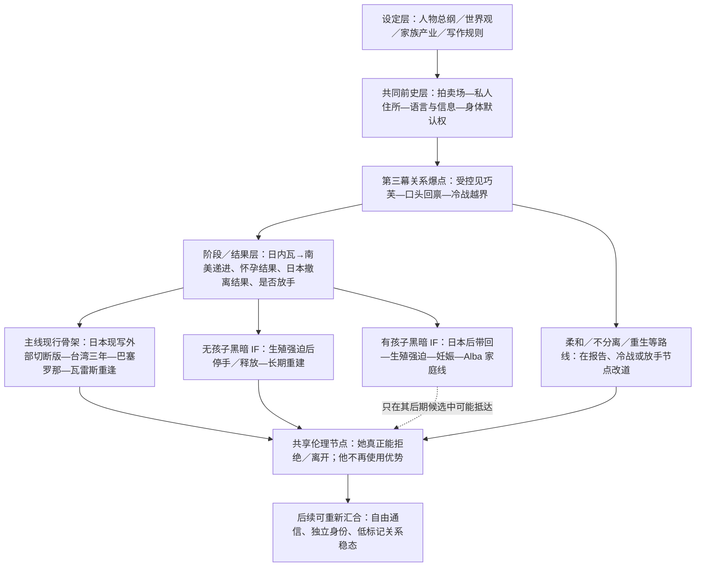

# 成果 1—2：INTJ AU 总体结构图与主线时间线

> 状态：全目录1,057个原文件均已逐篇读至EOF并完成交叉整理；主线277篇、GPT参考包60篇、有孩子IF讨论289篇及正文／设定253篇均已单独封口。图中“现行骨架”表示当前跨文档支持最强的项目结构，不把每一篇试写自动升级为正史。

## 一、总体结构图

这张图刻意没有把项目压成“主线—无孩子—有孩子”三叉树：

- 日内瓦→返意后边界延续→南美是第三幕主线的顺序阶段：先压近身体／空间距离，再压近心理距离，不属于 IF 分叉；
- 日本主线采用现写／原作母版：属下先接触却未能把她带回，外部力量切断控制；纯 B“警方先到”和纯 C“她明确拒绝”只作 ALT 事件结果，不升级为完整世界线；
- 柔和 HE、无分离火葬场、重生线可能从报告、眼泪、放手或死亡节点改道；
- 不同路线可以共享“允许拒绝—实际使用自由—重新靠近”这一伦理节点，却不要求共享同一场火、同一场重逢或同一结局外观；
- 有孩子线继承共同前史与人物底盘，但 Alba、妊娠、Night失势后五年重建、延续至Alba十五／十六岁前后的十余年家庭稳态及代际反噬均是该分支新增，不得倒灌主线。

## 二、材料层级与结构用途

| 层级 | 内容 | 可以确认什么 | 不可以据此确认什么 |
|---|---|---|---|
| 设定层 | 人物总纲、世界观、家族产业、空间、写作规则 | 人物底盘、权限、世界机制、风格禁区 | 某场已经发生、某句已经成为正文 |
| 路线层 | 分幕路线、剧情设计、阶段清单 | 事件功能、可能的先后与分叉点 | 最新日期自动等于 CURRENT |
| 正文／试写层 | `试写存档_*`、孩子 IF 正文版本 | 场景实际写法、物件、视角、节奏、事件版本差 | 单篇自称“正式稿”就覆盖全项目其他路线 |
| 讨论层 | `讨论归档_*`、补丁、侧边讨论 | 动机、冲突、候选解法、旧稿为何重写 | 理论判断自动成为人物已知事实 |
| 理论层 | Active Inference、荣格、双 INTJ、作者美学 | 上层校准、伦理判据、版本诊断 | 直接搬进台词或当作世界内术语 |
| 参考包／快照 | GPT thinking 包、集中阅读复制 | 保存某一阶段上下文和版本快照 | 比根目录正文拥有天然正史优先级 |

## 三、主线时间线

### 0. 前史与关系发动机

| 顺序 | 事件 | 当前确认 | 材料状态 |
|---:|---|---|---|
| 0.1 | 芷瞳与宋巧芙原有人生 | 两人是长期好友；芷瞳有台湾家庭、大学／深造路径，巧芙是她进入拍卖场后仍优先保护的人 | 基础设定；确切学籍需统一 |
| 0.2 | 拍卖场 | 芷瞳为巧芙提出“心甘情愿”；她指一次事件中的担责，Carillo 将其扩张为长期关系允诺 | 共同前史核心 |
| 0.3 | 雷厉风按下购买键 | “替即将冲下台的 Carillo 把保护冲动翻译成交易”是强解释候选；购买与后来所有权伤害仍成立 | SOURCE／CURRENT 候选，不可洗白 |
| 0.4 | 离开拍卖场 | 芷瞳与巧芙被拆开；Carillo 把她纳入私人秩序，巧芙去向不可独立验证 | 共同前史核心 |

### 1. 第一幕：进入礼貌而无旁路的秩序

1. 芷瞳带伤进入私人住所；门不一定锁，实际无可行出口。
2. 第一夜不是恋爱安抚，而是长期黑箱的第一夜：她不知道巧芙是否安全，也不知道 Carillo 何时会把身体要求落下来。
3. 她从伤、餐桌、下人、走廊和卡瑞洛处理事务的方式建立最初模型；信息首先用于减少未知。
4. 卡瑞洛逼她吃、吃药、换药；疼痛被处理不等于关系成立，芷瞳随后试图拿回药名、剂量和自理能力。
5. 她把“不逃”限定为当下策略与责任：巧芙未确认、语言和路线不明、自己有伤；不是终身放弃离开。
6. 她以 `A1-` 的意大利语底子偷记高频词，按谁说、何时说、随后发生什么做低置信度索引。
7. 早餐要求见巧芙被拒；当前应重写为“不给验证，所以不给安全感和道德清算能力”。

**第一幕状态：**芷瞳仍能把恐惧压成样本；Carillo 对她的兴趣是审美、保护、占有和“她会不会自己朝我偏过来”的混合。完整试写仍以 SOURCE／ALT 为主，没有一篇可单独宣布为定稿。

### 2. 第二幕：从记样本到使用样本

1. 时间约推进到入宅第四天，伤未全好；她发现 Carillo 对她和对下属不是一套标准，但不能把例外直接命名为关心。
2. 她利用后勤薄点、称呼和物件，拼出“另一位年轻女人—雷先生—Varese—转移痕迹”的低置信度链；不能提前宣告已知巧芙在瓦雷斯。
3. Carillo 察觉她“不知道的方式变了”，以更周到的生活服务封住热水、餐盘、药物等侧门。
4. 繁复衣裙、固定座位、空白时间、倒酒和烟灰缸把她从旁观者放进他的手边范围。
5. 身体线入口是“没有被碰到也发生了”：杯脚、手指、脚步和一句“继续”使身体先于解释泄密。
6. 她把平顺定义成工具，Carillo 把工具读取成归属；她追问巧芙，仍只得到他的口头保证。
7. 当前最稳的幕间桥是晚餐后“站住／过来／近一点”，直接进入第三幕默认接近权。

**第二幕族内首选：**巧芙转移链 A1 校准版、烟灰缸校准版、倒酒推荐意识流版、第二幕收尾推荐意识流版。它们仍是项目级 SOURCE，而非自动正史。

### 3. 第三幕前半：亲密默认权与外部世界漏出

1. “近一点”发展为移椅、抓腕、留在书房、晚间不再自动放她回房；Carillo 会在某些点停住，因为他想要真实朝向，但这不是可靠的同意保护机制。
2. 现行时空锚与局部顺序都已锁定：日内瓦第一夜不同床、第二夜改写夜间边界；返意后依次进入“房间还在 → 第一个吻 → 当晚收进怀里 → 第二天第二个吻 → 会所／吻后余波 → 那几天 → 第一次真正发生 → 次日复盘 → 白天默认权”。“第一次真正发生在返意后而非日内瓦”不是未决项；“两三天”是否需要精确到日只属于日历粒度。
3. 第一次之后先进入默认权建立期：接触不再需要单次理由，白天也发生，芷瞳缺少完整复位窗口；之后才进入偏甜样本期。
4. 她给出的谢谢、靠近、问安、等他回来、推杯子等动作既可能有策略，也有真实残留；不能由任何一方提前裁成全真或全假。
5. Carillo 因正反馈而更稳、更耐心、更愿意扩大生活半径；温柔仍建立在他掌握权限、巧芙与未来的结构上。

### 4. 第三幕两次远行：身体距离到心理距离

| 阶段 | 主要功能 | 当前证据 | 项目级判定 |
|---|---|---|---|
| 日内瓦三天 | 第一夜不直接同床；套房取消独立房门，第二夜开始改写夜间边界；返意后她的房间仍在，却不再自动属于她的夜晚 | `第三幕出国线设定补丁_v1.md`、`日内瓦三天时刻表_v1.md`、`日内瓦后边界延续补丁_v1.md`及`房间还在_v1` | CURRENT（身体／空间距离阶段） |
| 返意后延续 | 日内瓦的例外被固化为日常规则；“房间还在 → 两次吻与余波 → 那几天 → 第一次真正发生 → 次日复盘”后建立白天默认权；心理距离仍保留，甜期样本与误读继续累积 | `日内瓦后边界延续补丁_v1.md`及第三幕精神较对场景族 | CURRENT；位置与局部顺序均已锁定 |
| 南美—瓦雷斯 | 危险中保护、送离、她脱口而出的“那你呢”、等待与检查伤势，让真实关心越过防御；随后进入瓦雷斯 | 南美空间归档、短危机 v3、等待与回来 v1及瓦雷斯收口 v3 | CURRENT（心理距离阶段）；内部转场版本仍分 CURRENT／ALT／SOURCE |

**作者裁决：两段顺序共存。**日内瓦不是南美的低风险替代版，南美也不覆盖日内瓦。前者让外部安排和套房规则吞掉身体／夜间边界，后者让外部危险逼出尚未自由却确实真实的担心、等待与靠近。两段都只能让芷瞳观察工作世界，不能让她进入事业决策；不得把两次远行压成一次，也不得重复写两个“第一次吞掉房间边界”。

### 5. 瓦雷斯：巧芙可见、报告去语境与冷战爆发

1. 第一、二次见巧芙只确认身体状况、转移、看守和基本安全；巧芙不能一见面就完成关系诊断。
2. 第三次见面，芷瞳解释自己如何识别 Carillo 想要“她正在向他移动”，以及如何用小信号维持见面口子；她没有宣告所有反应都是假的。
3. 能听懂中文的旧系统人员口头回禀，把语气、羞耻和混杂真反应压成“她知道什么能让您相信”。
4. Carillo 不能承受半真半假，把它防御性地判成全骗；伤口是被她看穿并利用，不是她和巧芙谈私事。
5. 族内最完整爆发链：撤见面 → 规矩／买下 → 贬低等待与靠近 → 所有权 → 她问为什么一开始要心甘情愿 → “我不需要你愿意” → 完成的身体越界 → “别想再骗我” → 她迟发落泪 → 他离开。
6. 这不是误会：他的系统把她的有限自保判为“我的人越界”，她的立场是“我从未自愿进入你的秩序”。

### 6. 冷战：冻结、未怀孕路线与慢性确认

1. 芷瞳先冻结、少食、浅眠，对再次靠近有身体惊惧；怀孕恐惧先是封闭空间中的等待，不是可靠症状。
2. 主线根目录第三幕采用“结果未怀孕”路线：答案到来后她明显松气；Carillo 被她庆幸没有留下更深后果刺中，以抱睡重新收距离。
3. 该节点是孩子 IF 的关键分叉口，主线未怀孕不能否认 IF 的真实妊娠，IF 也不能倒灌主线。
4. 日常恢复为饭桌、书房、会面和固定路线；她收回照料，不再提醒他吃饭或推水。
5. 身体仍可能有反应，但她拒绝让反应替自己作关系判词；“不拒绝”不等于同意。
6. Carillo 越来越只能靠身体证明影响仍在，拿不到眼神、主动和意义；“看我／睁眼”的命令开始露出求。
7. 意大利语安抚成为他夜里防御裂缝；她当时听不懂，只记住音节和声调。

### 7. 日本事件：主线与 IF 的共同父节点

1. 日本行动／据点遭袭，Carillo 重伤，身份和住处暴露，必须撤离。
2. 芷瞳仍在住处；Carillo 坚持亲自回去，雷厉风基于行动判断阻拦并与他动手，最后改派属下。
3. 不能写成警方已经把她带走后他追警方车队；警方对芷瞳是受害者保护系统，不是威胁。
4. 同一执行节点至少有四个结果：

   - A：属下在警方前把她带回——黑暗有孩子 IF 的必要入口；
   - B：警方先一步救走、属下没有接触到她——ALT；
   - C：属下找到她，但她明确拒绝返回，随后进入警方保护——ALT；
   - D／现写版：属下先接触并试图带走她；她听见 Carillo 重伤、想回来接她，没有明确跟随或拒绝；外部力量利用属下不敢伤她的迟疑把她带离，之后她抱住巧芙说“回家”——主线 CURRENT。

5. 现写版不是 B 与 C 的拼接：它保留“外部秩序切断控制”和她当时尚无完整行动力的双重事实，符合原作母版及现有连续正文。B、C 只保留作替代实验。

### 8. 第四幕：日本获救后的台湾三年

#### 第一年：冻结、叙述权与身体重新落地

- 父母接回，自己的床、热水和普通灯光并未立即让她恢复；她不主动查 Carillo，只被动留意世界是否出现死亡消息。
- 返校流言与亲友善意让她看到正常世界也会替她命名；Fi 轴从羞耻转为“凭什么替我说”。
- 武术和站桩不是复仇训练：她要让身体从僵住、被按住和只会预测别人，变回能承重、能抖、能继续动作的自己的身体。
- 音乐随后恢复呼吸与声音；顺序不能倒成先用理论理解一切。

#### 第二年：功能恢复、语言与边界

- 固定意大利语课堂把旧黑箱变成普通可学系统；她逐渐理解冷战夜里的母语低语可能是安抚，但理解不抵消伤害。
- 正常、安全、尊重停止的男性参照证明她能识别边界，却不能解释 Carillo 为何曾进入她的系统；不发展新恋爱线。
- 合法运动射击让她在规则、呼吸、准星和即时误差中面对巨响；这是独立兴趣与行动能力，不是杀手化。

#### 第三年：承认复杂性但不回头

- 她能承认策略里有真、自己确实伤到过他，也看懂“我不需要你愿意”是防御；仍不等于原谅。
- 《意大利旅行》触发她承认“爱过”；爱没有行动指令权，不导致联系、寻找或返回。
- 她继续研究生／学术生活，等待外部事件而非主动回头。

#### Carillo 的平行三年

- 初期仍想伤好后把她带回；现实“暂时不能”才逐渐转为“不能再那样做”。
- 未经同意的远程安全线从细密生活报告削薄为路线／异常接触；这仍侵犯边界，不能美化成纯尊重。
- 她学武术让他明白她在练习不再被按住；学意大利语使他承认自己真正想要她愿意；射击使他看见“保护能力”不能再证明关系资格。
- 他清理把中文私密情报化的旧链，不惩罚执行旧规则的人；错在规则。
- 欲望被自限为不抵达她的想念；敏锐从确定句降为“也许”。

### 9. 第五幕：独立学术身份下的外部强制重逢

1. 芷瞳以论文作者／报告人身份到巴塞罗那参会，次日有 10:30 报告和自己的行李、证件、生活轨道。
2. 旧仆人 Luca（暂名）借旧关系绑走她；她用武术反抗，仍被药物压制，并用意大利语听懂“不是命令，是机会”。
3. 在瓦雷斯，她先问“这是你的命令吗”，再问“他为什么会以为你会满意”。Carillo 必须承认旧系统由自己塑造。
4. 他原本未下绑架命令，却在她要求离开时说“不想让你走／现在不行”；芷瞳指出“从现在开始，是你的命令了”。旧人擅自回手在此转成他的当下拘留。
5. 包、护照、手机、会议身份被找回；她亲自写给家人的报平安，内容归她，传输通道仍归他。
6. 空间采用套间校准：外间起居室＋内间卧室；第一夜她因药物和疲惫睡内间，之后主要在外间。仆人止步，Carillo 不跨门槛；无触碰不等于放行。
7. 她重新走到内院石廊、巧芙旧房间和水泉，测量旧空间；旧“花厅”与“她过去熟悉图书室”均已被后版纠正。
8. 第一周形成门不锁、监视仍在、共同用餐、他进入后在固定位置停下的稳定危险。
9. 旧灰书被保存；她主动要求一个不在他房间的白天空间，获得西侧房间和图书室权限；“还有别的？”是权限语言第一次局部倒转。
10. 侧厅空白框让她记录：变化是真的、来得太晚、仍经他的权力。关注重新发酵，不是原谅。

### 10. 第五幕可拔插外部权力路线与当前最远端

以下 Pastor／东方倾城／Grey／南美短离为第五幕候选路线中的族内 CURRENT 或 ALT／SOURCE 链，不因通向最远出口便自动升级为项目正史；若拔除，必须另给组织压力、信息边界和短离外因。

1. 牧师 v12：他看见 Carillo 已让芷瞳走进主堡更深区域，并提醒私人失衡正在碰到组织风险。
2. 信息边界 v3：Carillo 告知台湾行动、雷厉风参与、将有人回瓦雷斯、森林禁入；给足以判断的事实，不让她参与黑暗决策。
3. 东方倾城被带回、昏迷七天、醒后进入高层会议；芷瞳从 Ophelia、动线和气氛读到变化，不成为事务参与者。
4. 森林事件 v12：东方倾城以 Grey 的弓箭反杀 Grey；后事由雷厉风处理，Carillo 只负责边界信息。
5. 共同用餐、夜廊、Carillo 与雷厉风短赴南美三四天、归来时发梢触碰后主动停住，逐步建立低频身体／注意力线。
6. **当前实际最远正文出口：**`试写存档_第五幕重逢篇_书房外间并行_芷瞳侧_v4.md`。半开门并行已成立，自由仍未归还。

## 四、主线当前状态一句话

主线不是“他们已和好”，而是：芷瞳在独立身份中被旧系统强行带回；Carillo 已不再把她的每个反应当许可证，却仍亲自扣住离开权。两人能在书房内外并行，说明日常与关注重新成立；未归还自由，说明关系合法性仍未成立。

## 五、主线时间线硬冲突待决

| 编号 | 冲突 | 当前处理 |
|---|---|---|
| T-01 | 日内瓦归来至南美启程之间的桥段 | 两段均为 CURRENT；待锁具体间隔、哪些身体默认权／甜期场景落在中间，以及第三幕同行南美与第五幕南美短离如何形成回声而不混时 |
| T-03 | 学籍：本科已毕业／研究所延期／中期答辩／三年后快毕业 | 需建立录取、入学、三年分离和巴塞罗那会议的统一年月表 |
| T-04 | Carillo 清理中文报告链 vs Luca 会中文且能调旧关系 | 明确是否不同旧链、漏网者或离职后回手 |
| T-05 | 瓦雷斯海／潮声 vs 现实湖区与森林水泉 | 决定架空地理或统一改写为湖／风雨声 |
| T-06 | 父母、学校、会议方收到单向报平安后的现实反应 | 第五幕须补外部搜索、警方和会议善后，不能靠“先别公开”无限冻结 |
