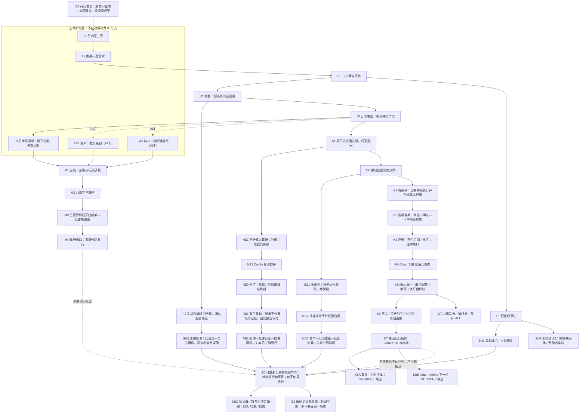

# 成果 3—4：主线与各 IF 继承关系表、完整 IF 分支图谱

> 图谱原则：世界线节点、事件路线变体、场景版本和理论候选分层处理。箭头可分叉，也可在“自由通信／独立身份／主动返回”等伦理节点重新汇合；相似结局不抹平不同前史。

## 一、多层 IF 分支图谱

### 图例

- `M`：当前主线结构；
- `T`：事件路线变体；
- `F/SH`：柔和修正路线；
- `NS`：不分离火葬场；
- `NC`：黑暗无孩子 IF；
- `K`：黑暗有孩子 IF；
- `RB`：继承前世惨局的重生复合 IF；
- 虚线：可共享后期伦理条件，不表示已经写成同一个结局。

## 二、分支节点登记表

| 节点 | 分支名称／类型 | 父节点 | 分叉事件或决定 | 继承 | 改变 | 下游 | 状态 | 对正文／人物弧线影响 |
|---|---|---|---|---|---|---|---|---|
| T1 | 日内瓦三天／身体距离阶段 | C0 | 第三幕第一次工作远行；同套房取消独立房门，返意后夜间边界不恢复 | 同一人物、心甘情愿误读、身体默认权、现代跨国后台 | 身体／空间距离靠近并固化为日常规则，但不等于心理信任 | T2 | CURRENT（主线结构） | 第一夜不直接同床；“房间还在但夜晚不再自动属于她”是返意后关键后果 |
| T2 | 南美—瓦雷斯／心理距离阶段 | T1＋返意后边界延续 | 后续南美工作远行；危险中保护、送离、等待和回来 | 已经靠近的身体距离、甜期小样本、工作世界漏出 | 她脱口问“那你呢”、等待并检查伤势；真实担心让心理距离缩短，Carillo据此加深“她朝向我”的误读 | R0 | CURRENT（主线结构；场景版本分级） | 心理靠近真实但发生在不自由结构中，不等于同意；因此瓦雷斯报告把半真判成全骗时更痛 |
| R1 | 主线报告爆发 | R0 | Carillo 把去语境回禀当成“全骗”，用主位压回 | 全部共同前史、巧芙、关系样本 | 发生身体越界、冷战、未怀孕主线、日本分离 | J0 | 现行主线结构 | 芷瞳从解释权冲突进入身体／叙述权重建；Carillo 开始承担失去 |
| F1 | 报告后忍住 | R0 | 他抓住“并非全假”的反证，第一次控制自己不去控制她 | 报告已发生，前期样本不变 | 不发生主线级爆发；较早学习等待 | SH1／SH2 | ALT 完整 IF 入口 | 测试“有欲望但不把欲望变成惩罚” |
| F2 | 冷战夜提前承认 | R1 | 眼泪在彻底恶化前击穿防御；他承认想要她愿意并问是否回家 | 已有报告与冲突，比 F1 伤害更深 | 修复速度提前；她先回台湾 | SH3 | ALT 路线变体 | 不是“报告前忍住”；自由通信成为验证 |
| T3 | 日本现写／原作母版：外部切断 | J0 | 属下先接触并试图带走她；她听见 Carillo 重伤欲返，没有明确跟随或拒绝；外部力量利用属下不敢伤她的迟疑将她带离 | 冷战、日本袭击、Carillo 重伤、芷瞳想回家却暂时缺少主动逃跑能力 | 旧系统第一次已经碰到她却仍无法把她带回；她获救后抱住巧芙说“回家” | JM | CURRENT（主线事件结果） | 同时保留外部制度破局、真实牵扯与尚未完成的主体重建；不把危机瞬间写成突然清醒 |
| T4B | 日本纯 B：警方先到 | J0 | 属下到达前她已进入警方保护，双方没有现场接触 | 同上 | 更纯粹强调制度先行救援 | JM | ALT（事件结果） | 会删去“他重伤仍想回来接她”的直接传递与旧系统提取失败现场 |
| T4C | 日本纯 C：明确拒绝 | J0 | 属下找到她，她当面选择不跟随，随后进入警方保护 | 同上 | 主体拒绝在现场被明确说出 | JM | ALT（事件结果） | 拒绝权更显性，但会把台湾三年才逐步重建的判断力提前压进危机瞬间 |
| JM | 日本获救主线 | J0＋T3 | 芷瞳与巧芙回台湾 | 拍卖、冷战、爱恨混杂、Carillo 重伤欲回 | 身体和社会位置离开旧秩序 | M2 | CURRENT（结构） | 分离不是不爱，也不是当场完成全部判断，而是先获得能重建主体性的外部条件 |
| M2 | 台湾三年 | JM | 她不主动回头，重建身体／语言／声音／学术；他削薄安全线 | 旧身体记忆、意大利语低语、巧芙与家人 | 她有合法身份和退出能力；他从“想带回”走向自限 | M3 | CURRENT（结构） | 使后来的任何返回区别于被带回 |
| M3 | 巴塞罗那—瓦雷斯重逢 | M2 | Luca 借旧系统绑架；Carillo 从“非我命令”转成当下亲自扣留 | 三年能力、旧系统责任、瓦雷斯空间 | 无触碰／逐步边界，但仍不放走 | M4 | CURRENT（结构父链）；现有 v1 实现为 ALT／SOURCE | 父链支撑 M4，但 Luca 动机及会议／学校／警方／领事善后仍须补写 |
| M4 | 书房外间并行 | M3 | 半开门下共同工作／阅读成为新日常 | 第五幕第一周、空间权限、外部组织压力 | 关注与日常重建，自由仍未成立 | E0 或后续危机／放手 | CURRENT（最远正文出口） | 当前真正写作入口；下一步不能直接和解 |
| JA | 日本后带回 | J0 | 属下先于外部力量带回芷瞳，巧芙回台湾 | 冷战、Carillo 重伤、芷瞳拒绝旧结构 | 她未获得主线式外部自由 | NS1 或 D0 | 黑暗 IF 上游 CURRENT／主线非采用 | 不是孩子线唯一含义；可继续走无分离或生殖绑定 |
| NS1 | 不分离火葬场 | JA | 他尝试补偿、放宽、身体确认，仍无法生产自由 | 同一人物、无巧芙把柄或把柄已解除 | 长期慢性失败，直到主动放手 | NS2 | ALT 完整 IF 母线 | 比无孩子线更晚、更深地学会放手 |
| NS2 | 主动放手 | NS1 | Carillo 不再把补偿当自由，正式让她离开 | 长期同住伤害与欲望仍在 | 切断主动追索 | NS3／RB1 | ALT 强结构节点 | 放手不是求她回头；她必须真的使用自由 |
| NS3 | 死亡／失踪／外部重逢组 | NS2 | 暗夜倒台后被捕、重伤、死亡、失踪或外部再遇 | 已主动放手 | 结局外观不同 | E0 或 RB1 | ALT 结局族 | 不能把牺牲自动写成赎罪；重逢需她主动验证 |
| D0 | 黑暗生殖绑定决策 | JA | Carillo 以怀孕／孩子制造不可撤回未来 | 冷战伤害、她不愿回旧秩序、家族／医疗后台 | 从直接占有转为生物、家庭、父亲身份绑定 | NC1 或 K1 | 黑暗 IF 共同父节点 | 这是伦理降级，不是爱情升级 |
| NC1 | 无孩子执行失败 | D0 | 连续强迫数日、她在“别让我恨你”后仍被继续，最终哭崩；无怀孕事实支撑 | 已造成生殖强迫伤害 | “留住她”叙事崩塌 | NC2 | CURRENT（无孩子分支设计） | 停手是失败性伦理退让，不是当场赎罪 |
| NC2 | 认输式放手 | NC1 | 他先明确允许回家，之后才病倒／受伤 | 伤害、爱、欲望都保留 | 她仍离开；病与道歉不成为筹码 | NC3 | CURRENT（无孩子分支设计） | 雷厉风守住“让你走不是让你回头” |
| NC3 | 三年—旧案—远距—失势 | NC2 | 旧人口贩运案把她带回欧洲；多次酒店送别和主动信号验证安全 | 独立台湾生活、旧伤、Carillo 自限 | 平等恋爱、自由通信、后期共同判断风险 | E0 | CURRENT（分支设计；无正式正文） | 修复靠反复可离开，不靠一次原谅 |
| K1 | 有孩子执行成立 | D0 | `我要你怀我的孩子`后持续执行；停止点在当夜完成、她哭到力竭之后；妊娠真实成立 | 日本后伤口支架、冷战伤害、家族／医疗后台 | 从恐惧锁定转成不可逆身体后果 | K2 | CURRENT（孩子 IF） | 不是一次失控或及时止损；怀孕先压垮她，吃饭不等于软化 |
| K2 | 停止—确认—早孕制度 | K1 | 空白 v5→月事 v6→医生前夜 v10→双侧确认→第一顿饭→早孕照顾 | 瓦雷斯、仆人、医生、身体熟悉与意愿污染 | 停止近身但未放人；照顾有用且像安静接管 | K3 | CURRENT；连续光标位于 K2→K3 边界 | 真正出口在照顾制度形成后、迁居前；医学只作确定性锚点 |
| K3 | 迁居／孕中后期／出生 | K2 | 从瓦雷斯套间／公开权力中心迁入较独立的意大利私宅；第一封信 v3；生产与产后 | `连小姐`、受控信息、孩子母亲待遇 | 空间更可呼吸但不可退出；出生后才逐渐形成`夫人`秩序 | K4 | 连续缺口＋孤立 CURRENT 岛 | 迁居连续场、生产与产后链尚缺；有限见父母 v1仅 SOURCE |
| K4 | Alba／幻影家庭线 | K3 | 出生、父职、母职六阶段、名字／生日／教育、研究与分房日常持续 | Carillo／芷瞳、家族、私名、产业、旧伤 | 新增 Alba、真实父女关系、事实女主人位置、代际误读 | K5 | CURRENT 场景族＋中段缺口 | 好父亲不能洗伴侣起点；家庭真实温暖反而增加审判复杂度 |
| K5 | Alba 真相与撤离 | K4 | 婚礼／房间／台湾／拍卖证据累积；Alba 询问母亲是否想走 | 家庭历史、学校朋友、父母双向爱、`知遥`命名 | 女儿不再接受家主叙事；母女进入撤离计划 | K6 或 KT | 证据链 CURRENT；实际取得同意与撤离执行待写 | Alba 是主体与见证者，不是决定母亲人生的工具 |
| KT | 台湾追去／被赶走 | K5 | Marcello 没有真正不追，亲赴台湾短路会面 | 分离事实与母系空间 | 取消／延迟自由验证，父母知情与叙事权整套改变 | 可另建下游 | ALT（与 K6 互斥） | 不能只抽取高光坦白再回现行主动回归线 |
| K6 | 不追／独立／自由期 | K5 | 她回父母家；他不追、不问、不用 Alba；资产、住处、研究可支配 | 女儿关系、台湾与意大利、旧伤 | 退出第一次成为社会和经济事实；自由期约八个月 | K7 或继续分离 | CURRENT 骨架；总时长待季节／年龄核算 | 不追只是底线，不是不要或赎罪；Alba 可陪送后回学校 |
| K7 | 主动回归后修复 | K6 | 芷瞳主动回来；归来 v10→生活缓冲→资产／`不要我了`v8→不追复盘 v5→身体重解 v4 | 自由期、独立资产、女儿、旧家庭记忆 | 回来不取消独立；旧身体、称谓与照顾逐项重命名 | E0／K8A／K8B | 按故事年月最远的 CURRENT 样本链；中间缓冲待写 | 主动扣手／拥抱才是愿意证据；归来 v10的“对不起，让你等了这么久”只修复迟到，不撤销离开／不原谅的正当性，也不制造等量罪责；`夫人_v4`仍 ALT |
| K8A | 事业／公共主体 | K7 | 失势后五年、Andrea／Lorenzo与合法事业重启 | 已修复成人边界、产业与家族史 | 芷瞳以独立研究者／有限合作者进入公共世界 | 独立下游 | SOURCE／候选 | 不能把她写成黑线共治者；2019–2020与人物年龄待核 |
| K8B | Alba—Valerio 下一代 | K7 | Alba成年后的边界型亲密与代际现代化 | 父母历史、家族教育、Alba自己的学校／事业 | 下一代不再为父母关系承担修复任务 | 独立下游 | SOURCE／候选 | 不能用下一代甜线替代父母尚未完成的责任 |
| K8C | 见父母／后期法定婚姻 | E0 | 自由共同生活数年后，芷瞳主动邀请；是否登记婚姻另行决定 | 已有退出能力、父母知情一致、家内称谓已重命名 | 外部法律身份可能成立，但不倒推早年`夫人`即婚姻 | 独立下游 | SOURCE／候选 | 见父母与婚姻均由她主动；家内待遇不能提前制造法律事实 |
| SH1 | 柔和 A：关系修复 | F1 | 他忍住爆发并允许混杂真反应存在 | 报告前史、巧芙、前期不平等仍在 | 较早进入边界修复 | E0 | ALT 完整 IF | 不能写成“没爆发所以旧控制没问题” |
| SH2 | 柔和 A2：黑暗共同体 | F1 | 芷瞳留在系统内，以信息／语言／管理进入共治 | 与 SH1 共享早期克制 | 她成为内部权力主体、参与失势重建 | 独立下游 | EXPERIMENT／ALT | 产业棋盘未完成；禁直接写“夫人女大佬爽文” |
| SH3 | 柔和 B：回家通信 | F2 | 他主动问是否回家；她先回台湾，再自由联系 | 已发生报告／较轻冷战 | 她以自己的意大利学术申请返回 | E0 | ALT 路线变体 | 与 F1 同名不同入口，必须分开索引 |
| RB1 | 重生柔和 | NS3 | 继承主动放手、自毁／死亡的前世，回到口头报告前 | 前世完整记忆与代价 | 把问题从“她骗没骗”改为“我会不会再毁掉她的真” | RB2 | ALT 复合 IF | 成熟度来自前世，不得借给主线重逢 Carillo |
| RB2 | 重生后自由通信／回归 | RB1 | 忍住、承认“我知道”、允许回家，失势后她主动回意大利 | F1/F2 的部分伦理语法＋前世记忆 | 早期建立等待与不使用优势 | E0 | ALT | 可与 SH3 后期重合，不能抹去不同上游记忆 |
| E0 | 自由证据节点 | 多线 | 她实际能拒绝、离开、拥有身份；他不把优势送达 | 各线各自伤害历史 | 留下／返回才具有意义 | E1 | 跨线伦理结构，不是单一世界线 | 允许局部重新汇合但不等于互相覆盖 |

## 三、主线与 IF 继承关系总表

| 要素 | 主线 | 无孩子 IF | 有孩子 IF | 不分离火葬场 | 柔和／重生 |
|---|---|---|---|---|---|
| 拍卖与心甘情愿误读 | 继承 | 继承 | 继承 | 继承 | 继承 |
| 巧芙受控与报告爆点 | 发生 | 继承其伤害前史 | 继承 | 继承 | F1 仍收到报告；F2 已冲突；重生回到此节点 |
| 冷战身体越界 | 发生 | 通常继承并进一步进入生殖强迫 | 继承并进一步进入生殖强迫 | 发生 | F1 可避免；F2 较早截断；重生避免重演 |
| 日本袭击 | 主线分离父节点 | 可能作为带回上游 | A 结果为强入口 | 发生且芷瞳被带回 | 柔和通信中可仅作受伤／关心验证；重生线前世发生 |
| 是否真正离开旧系统 | 日本后立即 | 生殖强迫失败后 | 很晚，须经 Alba／资产／强分离 | 主动放手后 | 较早被允许回家 |
| 是否有 Alba | 无 | 无 | 有 | 无 | 通常无；黑暗共同体不等同孩子线 |
| 修复的主要证据 | 三年独立＋第五幕仍待归还自由 | 多次酒店告别／远距恋爱 | 强分离、不追、独立资产、她主动 | 正式放手＋她使用自由 | 早期克制、自由通信；重生靠前世代价 |
| 主体性风险 | 重逢后仍被扣留 | 病／失势被误用为回头筹码 | 孩子、家庭、父职、资产替代自由 | 自毁／死亡被误写成赎罪 | 忍住被误写成一切旧结构已健康 |
| 当前材料成熟度 | 五幕大量试写，最远到书房外间 | 完整设计，无正式正文 | 253篇正文／设定已通读；前期连续到早孕制度成形、迁居前；按年月最远样本在自由回归后，但生产、撤离与普通生活仍有缺口 | 讨论设计较完整 | 讨论／补丁为主，黑暗共同体仍实验 |

## 四、可重新汇合但不能互相覆盖的节点

1. **允许回家：**F2、无孩子 NC2、NS2 与 RB2 都可出现，但分别发生在较轻冲突、生殖强迫失败、长期不分离惨局和前世重生后。
2. **自由通信：**SH3、RB2、NC3 都可使用；通信相同不代表 Carillo 的成熟来源相同。
3. **独立学术身份回意大利：**主线 M3 是被绑回；SH3／RB2 是主动申请／返回；NC3 是旧案作证触发后逐步主动。外观相似，授权性质不同。
4. **暗夜／瓦雷斯失势：**主线终局候选、NC3、NS3、RB2 与孩子 IF 家族失势都可能发生；损失对象、芷瞳是否在场、Alba 是否存在、她是否共同决策完全不同。
5. **主动拥抱／亲吻：**无孩子线的酒店告别、柔和线自由回访、孩子线分离后重新靠近都可使用；只有明确可拒绝与可离开时才是修复证据。有孩子线已写的`反扣手指／主动走近拥抱`属于 K7，不得倒灌到 K2–K4 证明早期愿意。

## 五、明确不进入 IF 图的材料

- 同一场景的 v1–v12、不同视角、节奏重写；
- “日内瓦第一夜用哪个房间”“水泉前先吃饭还是先看书”之类调度差；
- 作曲家偏好、衣裙颜色、杯子／袖口／头发等可回收物件；
- Active Inference、荣格、双 INTJ、“被看见／被接住”等纯理论；
- 根目录、GPT 包和集中阅读包中同 SHA 的物理复制。
